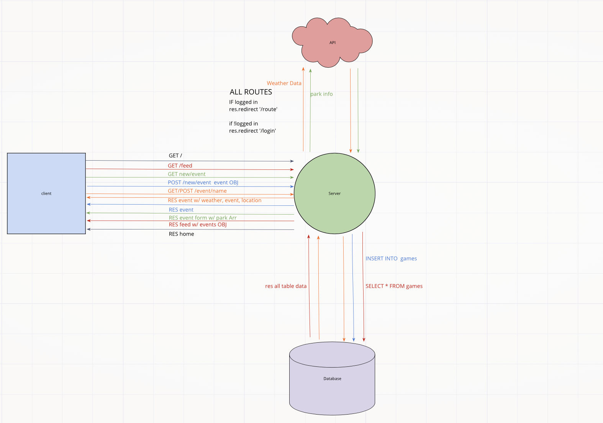
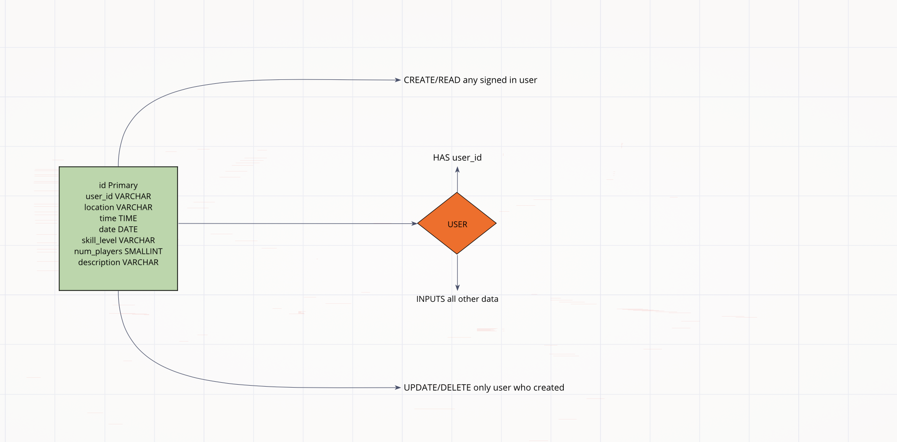

# Planning process:

https://trello.com/b/otGtLvfT/301-project

## User Stories 

### As a user, I would like to create soccer events.

**Number and name of feature:** 

**Estimate of time needed to complete:** 

**Start time:** 

**Finish time:** 

**Actual time needed to complete:** 

### As a user, I would like to create soccer events.

**Number and name of feature:** 

**Estimate of time needed to complete:** 

**Start time:** 

**Finish time:** 

**Actual time needed to complete:** 

### As a user, I would like to RSVP to events. 

**Number and name of feature:** 

**Estimate of time needed to complete:** 

**Start time:** 

**Finish time:** 

**Actual time needed to complete:** 

### As a user, I would like to search for events by day.

**Number and name of feature:** 

**Estimate of time needed to complete:** 

**Start time:** 

**Finish time:** 

**Actual time needed to complete:** 

### As a user, I would like a consistent view throughout the website.

**Number and name of feature:** 

**Estimate of time needed to complete:** 

**Start time:** 

**Finish time:** 

**Actual time needed to complete:** 

## Wireframes

## Models and relations

